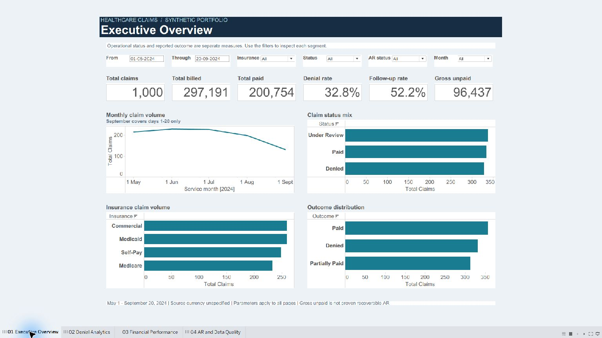
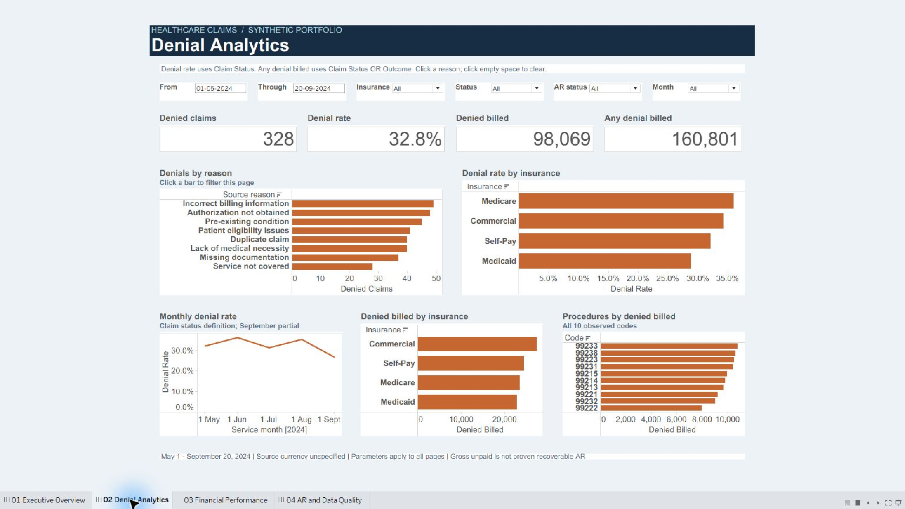
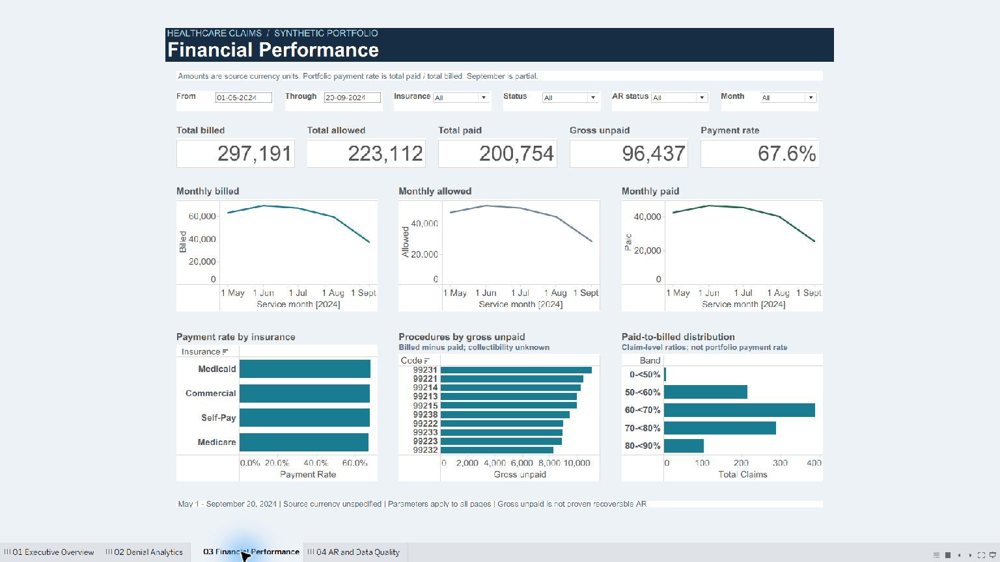
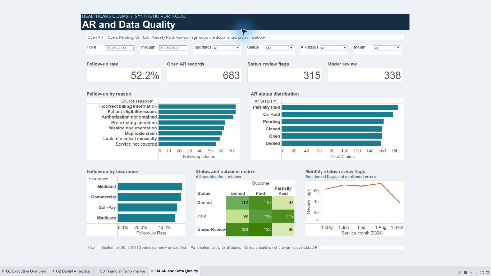
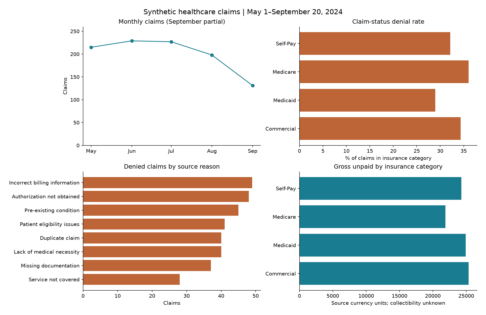

# Healthcare Claims & Denial Performance Analytics

**Status: project complete, including four native-verified Tableau dashboards.** Start with [project status](docs/project_status.md), [dashboard guide](docs/tableau_guide.md) and [business insights](docs/business_insights.md). Google Colab execution is verified. The complete project is published on [GitHub](https://github.com/shyamprakash-007/healthcare-claims-denial-analytics).

## Business Problem

Claims summaries can obscure different denial definitions, residual financial gaps and inconsistent status labels. This project creates a reproducible analytical model for a hypothetical revenue-cycle operations stakeholder.

## Objective

Analyze volume, denials, follow-up workload, service-month patterns and financial gaps while keeping source limitations visible. This is a Data Analyst / BI Analyst portfolio project, not clinical decision support.

## Dataset

The supplied synthetic `claim_data.csv` has **1,000 rows and 15 fields**, with services from **May 1 to September 20, 2024**. September is partial. Raw bytes are preserved, with a SHA-256 control in `docs/rules.json`. The source does not identify currency; all amounts use **source currency units**. No enrichment or invented entity attributes were added.

## Tools & Technologies

Python 3.12, Pandas, NumPy, an executed Jupyter notebook, DuckDB 1.5.5, PostgreSQL 18.3 via embedded PGlite 0.5.8, and SQL. The notebook was executed locally and in Google Colab; the separate Colab copy and runtime report are included. PostgreSQL validation uses the actual embedded engine, not a separately installed network service. Tableau Public 2026.2 renders the four dashboards from a packaged Hyper extract.

## Data Preparation

Audit before transformation; freeze the observed category vocabulary and review rules; trim whitespace; parse dates; preserve identifiers as strings; convert amounts; create independent denial and quality flags. No source rows were removed. No suspicious status or monetary value was silently rewritten. See [rulebook](docs/data_quality_rulebook.md) and [data dictionary](docs/data_dictionary.md).

## Data Model

One claim per fact row, supported by date, provider, patient, insurance, procedure, diagnosis and reason dimensions. `vw_claims_analytics` is the business-friendly detail view; `vw_kpi_summary` contains governed KPI controls. See [model](docs/data_model.md).

## Key Metrics

| Metric | Value |
| --- | ---: |
| Total claims | 1,000 |
| Claim Status Denied | 328 (32.8%) |
| Outcome Denied | 331 (33.1%) |
| Paid / Under Review claims | 334 / 338 |
| Follow-up claims | 522 (52.2%) |
| Total billed / allowed / paid | 297,191 / 223,112 / 200,754 |
| Gross unpaid amount | 96,437 |
| Payment rate | 67.55% |
| Denied billed amount | 98,069 |
| Status/outcome review flags | 315 |

All amounts are source currency units. [Complete metric definitions](docs/metric_definitions.md).

## SQL Analysis

37 business questions: 10 basic, 10 intermediate and 17 advanced. They use conditional aggregation, CTEs, ranking, LAG, cumulative totals and percentile logic. All were executed in both DuckDB and PostgreSQL, with matching results. See [query catalog](docs/sql_query_catalog.md), `sql/05_business_analysis.sql` and saved result folders.

## Tableau Dashboards

Open [Healthcare_Claims_Denial_Analytics.twbx](tableau/Healthcare_Claims_Denial_Analytics.twbx) in Tableau Public/Desktop. It includes the data extract and requires no database connection. Four pages cover Executive Overview, Denial Analytics, Financial Performance, and AR / Follow-up / Data Quality. Date, insurance, status, AR and month parameters apply across pages. Selecting a reason cross-filters the denial page. See the [dashboard guide](docs/tableau_guide.md).









## Key Findings

- Denial definitions overlap on only 112 claims; their union is 547 claims.
- Every denied-status claim has a positive payment. The 98,069 denied billed units include 65,931 paid units.
- Medicare has the highest observed denial rate (36.05%); Commercial has the largest denied billed amount (27,386).
- Incorrect billing information and Authorization not obtained account for 97 of 328 denied claims (29.57%).
- A denied-only follow-up queue would omit 358 claims marked for follow-up.

Each [business insight](docs/business_insights.md) states evidence, implication and potential action.



## Business Implications

Keep status and outcome denial measures separate. Treat financial gaps as descriptive amounts, not proven recoverable balances. Use the explicit follow-up indicator and investigate source lifecycle definitions before recommending process changes. No realized savings, recovered revenue or causal effect is claimed.

## Data Quality

No missing values, duplicate claims, invalid dates or monetary ordering anomalies were found. Leading zeros are preserved. Review rules identify 315 status contradictions, 218 additional ambiguities and 168 AR review flags. Flags overlap. Exact rules and category vocabularies are documented.

## How to Run

Extract `Healthcare-Claims-Denial-Analytics.zip`. Run these commands from the extracted project directory, using Python 3.12+ and Node.js 20+:

```text
python -m pip install -r requirements.txt
python scripts/pipeline.py
npm install
npm run validate:postgres
python scripts/check_backend.py
```

The Python runner recreates only the generated DuckDB database and processed outputs, preserving raw data. It audits, prepares, builds the schema, executes SQL and exports controls. PostgreSQL validation writes independent outputs; the last command compares all fields/query results and runs boundary tests. Open the notebook in Jupyter or VS Code and run all cells to reproduce the narrative and EDA figure.

**Colab:** upload/unzip the project into `/content/Healthcare-Claims-Denial-Analytics`, install its requirements, and open `notebooks/01_claims_data_preparation.ipynb`. The notebook locates the project directory. The cloud run completed on September 24, 2026: all 10 code cells and 62 validation checks passed, and the entire analytical export matches the local result. See [executed Colab copy](notebooks/01_claims_data_preparation_colab.ipynb) and [runtime report](docs/colab_execution_report.json). The supplied [Colab launcher](https://colab.research.google.com/drive/1zUz8A9lod7auAPeFAQMfjcm3F7v2aCzg) uploaded the project ZIP and executed the full notebook in the cloud; access follows your Google sharing settings.

**Conventional PostgreSQL:** create a fresh empty database, run 01_schema.sql, then run 02_staging_load.sql with psql from the project root after Python preparation. Continue with 03_cleaning.sql, 04_derived_metrics.sql, 06_views_for_tableau.sql, then 05_business_analysis.sql. The psql load/deployment path is provided but was not exercised against a network PostgreSQL service. The same schema and analytical SQL were exercised in embedded PostgreSQL.

Verification: 62 Python/DuckDB checks, 20 Python/PostgreSQL KPI checks and 87 boundary/cross-engine checks passed. [Validation report](docs/validation_report.md). Five Hyper controls and 58 native Tableau KPI display comparisons also passed. Counts and amounts match exactly; percentages match the one-decimal dashboard display. To rebuild the workbook after preparation, run `python scripts/build_tableau.py`. Open the delivered `.twbx` directly to explore without running Python.

## Project Limitations

Synthetic data, unspecified currency, incomplete September, no lifecycle timestamps, no provider/patient repeat observations, no confirmed cause of denial and no collection/aging evidence. See [full limitations](docs/limitations.md). Do not claim healthcare employment, medical coding expertise, HIPAA compliance experience or real consulting results.

## Future Enhancements

Event timestamps and appeal tracking could extend the analysis, with any synthetic enrichment explicitly labeled. No enhancement data was added in this build.

## Disclaimer

The dataset used in this project is synthetic and intended for analytics/portfolio purposes only. No real patient information or confidential healthcare records are used. This project is not associated with a real hospital, payer, provider or Enigma Healthcare Solutions.
