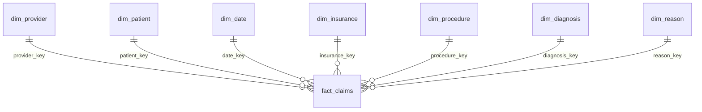

# SQL model and execution

`stg_claims` has the 15 normalized source fields as text, making casts explicit in SQL. The fact table has one row per claim, unique Claim ID, a surrogate claim_key, amount fields, original status fields, independent derived metrics and review flags. Monetary columns are NUMERIC(18,2). Required dimension keys have foreign keys. Dimensions contain only source codes, except the derived calendar dimension.

Cardinalities: fact_claims 1,000; provider 1,000; patient 1,000; date 143; insurance 4; procedure 10; diagnosis 100; reason 8. Normalizing provider/patient IDs has limited compression value because each occurs once. They remain separate to demonstrate the required claim-centered model without fabricating attributes.

`vw_claims_analytics` rejoins dimensions at claim grain. `vw_kpi_summary` exposes governed aggregate metrics. The first supplies the analytical CSV; the second supplies independent SQL KPI controls. Dimension uniqueness prevents join fan-out.

Run order: 01_schema, load staging, 03_cleaning, 04_derived_metrics, 06_views_for_tableau, then 05_business_analysis. The numbering follows the requested filenames; the query file uses views, so create views before executing it. All 37 queries were executed in both engines.

PGlite runs actual PostgreSQL in WebAssembly inside Node. Tested version: PostgreSQL 18.3, PGlite 0.5.8. This checks SQL semantics without installing a network service. The `psql` client-side staging command is supplied for a conventional PostgreSQL deployment, but that network-server deployment and psql command were not exercised here. [PGlite documentation](https://pglite.dev/docs/).
